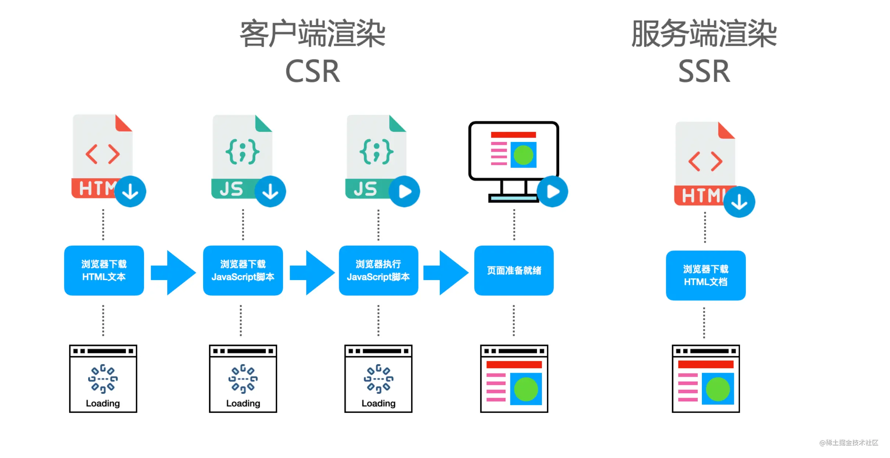

## 一: CLI脚手架, Dev Server

### CLI脚手架搭建

###### 方案

1. [Commander.js](https://github.com/tj/commander.js/blob/master/Readme_zh-CN.md)  属于 Node.js 生态中最早诞生的 CLI 方案，由 Node.js 大神 TJ 进行开发，属于元老级别的方案。 
2.  [Yargs](https://github.com/yargs/yargs)，虽然是后起之秀，但功能足够齐全，非常强大，比如内置参数校验、信息交互等模块，比较适合复杂的 CLI 开发。 
3.  [CAC](https://github.com/cacjs/cac)  优点是轻量、使用方便，整体的包体积只有不到 10 KB，是 `Yargs` 的 十分之一，`Commander` 的 三分之一，并且没有任何第三方依赖，同时也是 Vite 目前所内置的 CLI 搭建方案。 

### Dev Server 搭建

**概念**

开发阶段服务器, 本质是一个node.js开发的HTTP server

**作用**

- 资源进行编译，然后将编译产物返回给浏览器
- 实现模块热更新，在文件改动时能推送更新到浏览器
- 静态资源服务，比如支持访问图片等静态资源

## 二: 主题组件渲染

1. 入口HTML处理
2. React渲染层接入
3. 支持组件热更新

## 三: CSR SSR SSG

##### **CSR**

>  CSR 的全称是 `Client Side Render`，即客户端渲染，它的特征就是没有页面 HTML 的具体内容，依靠 JS 来完成页面渲染。在 Vue 或 React 大行其道的环境下，大部分的页面都是采用 CSR 的渲染模式，比如 Vite 官方脚手架的模板 HTML 
>
> ```html
> <!DOCTYPE html>
> <html lang="en">
>   <head>
>     <meta charset="UTF-8" />
>     <link rel="icon" type="image/svg+xml" href="/vite.svg" />
>     <meta name="viewport" content="width=device-width, initial-scale=1.0" />
>     <title>Vite + React + TS</title>
>   </head>
>   <body>
>     <div id="root"></div>
>     <script type="module" src="/src/main.tsx"></script>
>   </body>
> </html>
> ```
>
> ###### SR 模式也存在一些问题:
>
> - **首屏加载慢。** 一方面需要请求数据，会带来网络 IO 的开销，另一方面需要通过前端框架来渲染页面，这又是一部分运行时开销。
> - **对 SEO 不友好。** 因为没有完整的 HTML 内容，无法让搜索引擎爬虫摘取有用的信息。

##### SSR

>  SSR 的全称是`Server Side Render`，它的核心特征就是在服务端返回完整的 HTML 内容，也就是说浏览器一开始拿到的就是完整的 HTML 内容，不需要 JS 执行来完成页面渲染。 
>
>   
>
>  因为 DOM 元素事件绑定的逻辑仍然需要 JS 才能够完成，所以一般的 SSR 项目都会采用同构的架构，也就是在 SSR 页面中加入 CSR 的脚本，完成事件绑定。那么这个完成事件绑定的过程，也被称为`Hydration` 

##### SSG

>  SSG 全称为 `Static Site Generation`，即静态站点生成。它本质上是构建阶段的 SSR，在 build 过程中产出完整的 HTML。 
>
> ######  优点如下： 
>
> - 服务器压力小；
> - 继承 SSR 首屏性能以及 SEO 的优势
>
> 不过它也有一定的局限性，并不适用于数据经常变化的场景。你可以试想一个 10 分钟刷新一次的榜单，如果使用 SSG 方案，那么项目会进行频繁的构建和部署，并且也做不到良好的时效性。
>
> 因此，SSG 更加适合一些数据变化频率较低的站点，比如文档站、官方站点、博客等等。

